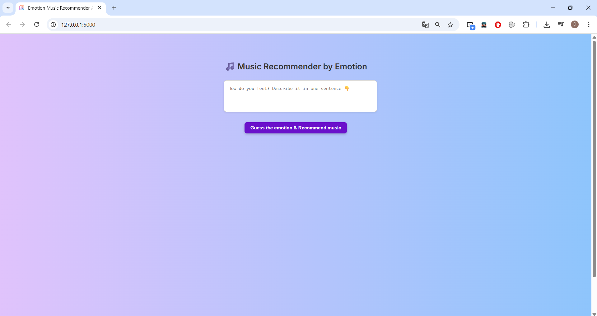
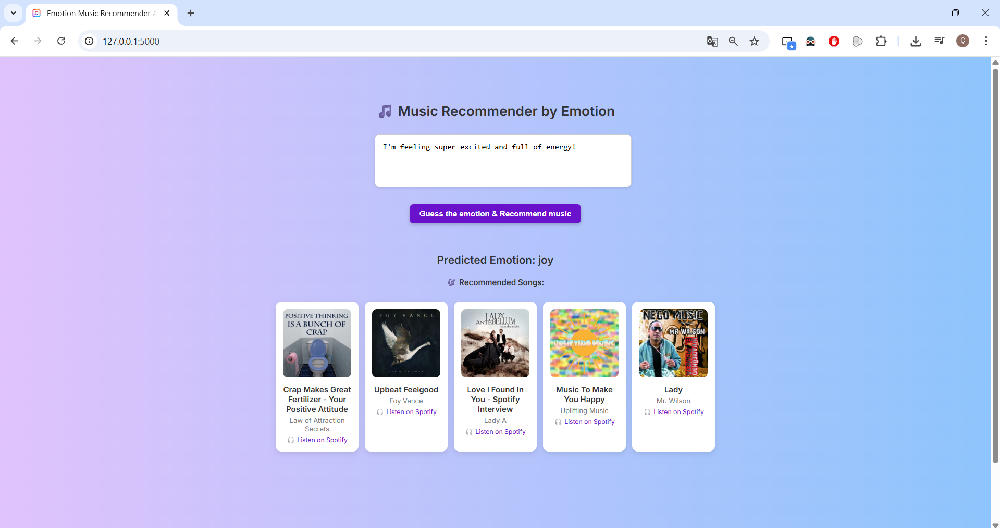
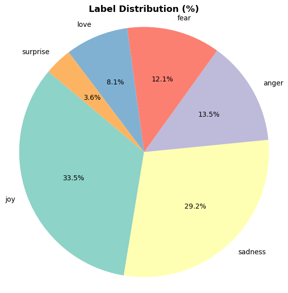
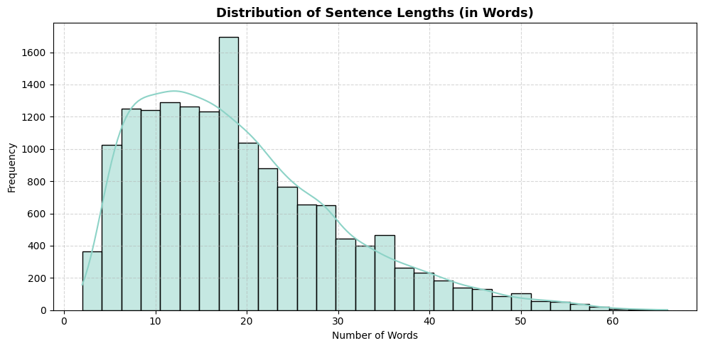
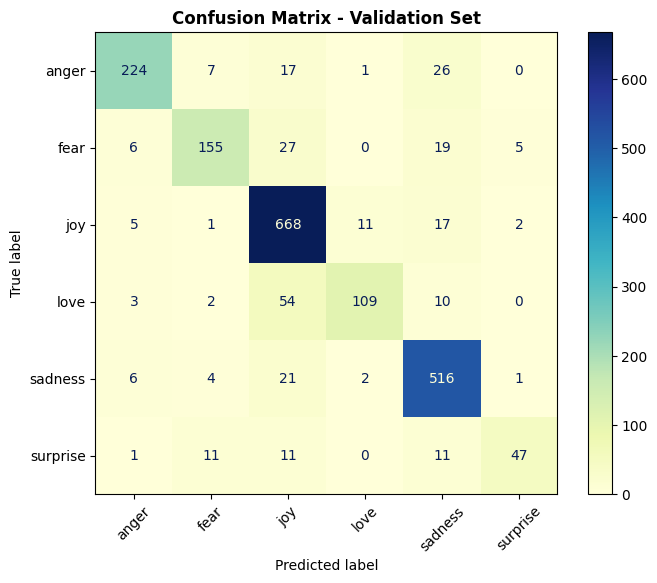

<a id="readme-top"></a>

<h1 align="center">Emotion-Aware Music Recommendation System</h1>

<p align="center">
  An intelligent NLP platform that detects human emotions from input text and curates personalized music recommendations to match your mood.
</p>

<p align="center">
  
  
  
  
  
</p>

<br>

## 📋 Table of Contents

1. [Overview](#overview)  
2. [Application Screenshots](#application-screenshots)  
3. [Key Features](#key-features)  
4. [Getting Started](#getting-started)  
   - [Prerequisites](#prerequisites)  
   - [Installation & Setup](#installation--setup)  
5. [Technical Architecture & Details](#technical-architecture--details)  
   - [Dependencies](#dependencies)  
   - [Model & Pipeline](#model--pipeline)  
   - [Model Insights & Analytics](#model-insights--analytics)  
6. [Folder Structure](#folder-structure)  
7. [License](#license)

<p align="right">(<a href="#readme-top">back to top</a>)</p>
<br>

## 🌟 Overview

**Moodify** is an AI-driven web application designed to bridge human emotional states with music discovery. By evaluating user text inputs, the system identifies emotional nuances and maps them directly to tailored music tracks.

### How It Works:
1. **User Input:** Enter any sentence, statement, or journal-style thought in the web interface.
2. **Emotion Inference:** A lightweight machine learning model classifies the text into discrete emotional categories.
3. **Music Curation:** The recommendation engine delivers matching tracks tailored specifically to the detected mood.

<p align="right">(<a href="#readme-top">back to top</a>)</p>
<br>

## 📸 Application Screenshots

<p align="center">
  
  <br>
  <em>Figure 1: Main Application Interface – Input text to discover your current emotion and music pairing.</em>
</p>

<br>

<p align="center">
  
  <br>
  <em>Figure 2: Analysis Results Screen – Displays predicted emotion along with recommended music tracks.</em>
</p>

<p align="right">(<a href="#readme-top">back to top</a>)</p>
<br>

## ✨ Key Features

| Feature | Description |
| :--- | :--- |
| **Real-time Emotion Classification** | High-precision text processing using TF-IDF vectorization and Logistic Regression. |
| **Curated Music Matching** | Contextual mapping between recognized emotions and music playlists/tracks. |
| **Responsive Web Dashboard** | Interactive, lightweight Flask application designed for smooth desktop and mobile interaction. |
| **Resource Efficient** | Optimized pipeline running entirely on CPU without requiring GPU hardware. |

<p align="right">(<a href="#readme-top">back to top</a>)</p>
<br>

## 🚀 Getting Started

Follow these steps to set up and run the project on your local machine.

### Prerequisites

- **Python:** Version `3.10` or higher
- **Package Manager:** `pip`

### Installation & Setup

1. **Clone the Repository:**
   ```bash
   git clone https://github.com/your-username/emotion-aware-music-system.git
   cd emotion-aware-music-system
   ```

2. **Install Required Packages:**
   ```bash
   pip install -r requirements.txt
   ```

3. **Launch the Flask Application:**
   ```bash
   python app.py
   ```

4. **Access the App:**  
   Open your browser and navigate to `http://127.0.0.1:5000`

<p align="right">(<a href="#readme-top">back to top</a>)</p>
<br>

## 🔬 Technical Architecture & Details

### Dependencies

Core libraries utilized in this project:
- **Flask:** Web framework & route handling
- **scikit-learn:** ML pipeline, TF-IDF vectorization, and inference
- **pandas & numpy:** Data preprocessing and array manipulation
- **matplotlib / seaborn:** Visualizations and statistical analysis

---

### Model & Pipeline

The emotion detection model was trained using the **Kaggle Emotions Dataset for NLP**, comprising six target class labels:
`['joy', 'sadness', 'anger', 'fear', 'love', 'surprise']`

* **Feature Extraction:** `TF-IDF Vectorizer` (`ngram_range=(1,2)`, `max_features=10000`)
* **Classification Algorithm:** Logistic Regression
* **Serialized Artifacts:** `emotion_model.pkl` & `label_encoder.pkl`

---

### Model Insights & Analytics

#### 1. Label Distribution
Balanced look at target emotion distributions across the dataset:
<p align="center">
  
</p>

#### 2. Sentence Length Distribution
Length metrics and token distributions analyzed during data exploration:
<p align="center">
  
</p>

#### 3. Model Confusion Matrix
Performance validation across predicted vs. actual emotion labels:
<p align="center">
  
</p>

<p align="right">(<a href="#readme-top">back to top</a>)</p>
<br>

## 📂 Folder Structure

```
.
├── app.py                         # Flask web application entry point
├── emotion_model.pkl              # Pretrained machine learning model
├── label_encoder.pkl              # Target label encoder artifact
├── requirements.txt               # List of Python dependencies
├── templates/
│   └── index.html                 # Main frontend template
└── static/
    ├── favicon.png                # Website icon
    ├── homepage.png               # Main landing page screenshot
    ├── results.png                # Prediction output screenshot
    ├── label-distribution.png     # Data insight plot
    ├── Sentence-length-distribution.png # Length analysis plot
    └── confusion-matrix.png       # Evaluation matrix plot
```

<p align="right">(<a href="#readme-top">back to top</a>)</p>
<br>

## 📜 License

Distributed under the **MIT License**. See `LICENSE` for more details.

<p align="right">(<a href="#readme-top">back to top</a>)</p>
